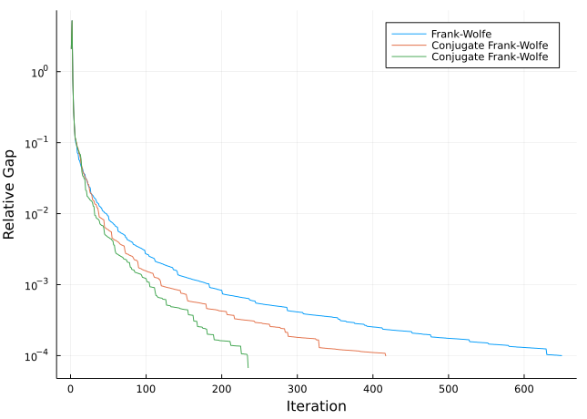

TrafficAssig.jl
================

TrafficAssig is a Julia package for…

1.  Load [Transportation
    Networks](https://github.com/bstabler/TransportationNetworks) data
    or construct traffic data from data frames.
2.  Traffic assignment with User Equilibrium.

## Examples

``` julia
using TrafficAssig

tntp = load_tntp("Anaheim")
assign_traffic(tntp)
```

    Start Execution
    Iteration:       1, Objective: 1291920.700626, Relative-Gap:      0.025318, Execution-Time:      0.039000

    Iteration:       2, Objective: 1287896.059193, Relative-Gap:      0.002939, Execution-Time:      0.091000
    Iteration:       3, Objective: 1287174.480144, Relative-Gap:      0.002377, Execution-Time:      0.123000

    Iteration:       4, Objective: 1286261.622092, Relative-Gap:      0.001158, Execution-Time:      0.170000
    Iteration:       5, Objective: 1286219.626519, Relative-Gap:      0.000541, Execution-Time:      0.217000

    Iteration:       6, Objective: 1286196.673703, Relative-Gap:      0.000523, Execution-Time:      0.264000
    Iteration:       7, Objective: 1286137.001056, Relative-Gap:      0.000477, Execution-Time:      0.311000
    Iteration:       8, Objective: 1286082.018464, Relative-Gap:      0.000162, Execution-Time:      0.358000

    Iteration:       9, Objective: 1286073.753072, Relative-Gap:      0.000145, Execution-Time:      0.409000
    Iteration:      10, Objective: 1286053.650226, Relative-Gap:      0.000091, Execution-Time:      0.442000

    TrafficAssig.TrafficAssigResults(TrafficImpl(416, [1, 2, 3, 4, 5, 6, 7, 8, 9, 9  …  412, 412, 413, 413, 414, 414, 415, 415, 416, 416], [117, 87, 74, 233, 165, 213, 253, 411, 379, 395  …  21, 402, 21, 404, 22, 405, 22, 406, 23, 407], sparse([2, 3, 4, 5, 6, 7, 8, 9, 10, 11  …  28, 29, 30, 31, 32, 33, 34, 35, 36, 37], [1, 1, 1, 1, 1, 1, 1, 1, 1, 1  …  38, 38, 38, 38, 38, 38, 38, 38, 38, 38], [1171.2, 721.1, 1222.5, 243.4, 637.4, 682.3, 44.3, 198.6, 12.3, 35.8  …  42.1, 16.6, 128.1, 87.1, 54.0, 47.9, 234.6, 63.8, 41.3, 6.0], 416, 416), Graphs.SimpleGraphs.SimpleDiGraph{Int64}(914, [[117], [87], [74], [233], [165], [213], [253], [411], [379, 395], [338, 362]  …  [38, 53, 390, 408, 416], [211, 407, 409], [167, 408, 410], [396, 409, 411], [8, 410], [21, 402], [21, 404], [22, 405], [22, 406], [23, 407]], [[88], [62], [75], [234], [118], [166], [214], [411], [379, 395], [338, 362]  …  [38, 53, 390, 408, 416], [212, 407, 409], [168, 408, 410], [396, 409, 411], [8, 410], [21, 402], [21, 404], [22, 405], [22, 406], [23, 407]]), BPR([1.090458488, 1.090458488, 1.090458488, 1.090458488, 1.090458488, 1.090458488, 1.090458488, 1.0, 1.0, 1.0  …  1.0, 2.0, 1.0, 2.0, 1.0, 2.0, 1.0, 2.0, 1.0, 2.0], [1.090458488, 1.090458488, 1.090458488, 1.090458488, 1.090458488, 1.090458488, 1.090458488, 1.0, 1.0, 1.0  …  Inf, 2.0, Inf, 2.0, Inf, 2.0, Inf, 2.0, Inf, 2.0], [9000.0, 9000.0, 9000.0, 9000.0, 9000.0, 9000.0, 9000.0, 5400.0, 5400.0, 5400.0  …  5400.0, 5400.0, 5400.0, 5400.0, 5400.0, 5400.0, 5400.0, 5400.0, 5400.0, 5400.0], [0.15, 0.15, 0.15, 0.15, 0.15, 0.15, 0.15, 0.15, 0.15, 0.15  …  0.15, 0.15, 0.15, 0.15, 0.15, 0.15, 0.15, 0.15, 0.15, 0.15], [4.0, 4.0, 4.0, 4.0, 4.0, 4.0, 4.0, 4.0, 4.0, 4.0  …  4.0, 4.0, 4.0, 4.0, 4.0, 4.0, 4.0, 4.0, 4.0, 4.0], [0.0, 0.0, 0.0, 0.0, 0.0, 0.0, 0.0, 0.0, 0.0, 0.0  …  0.0, 0.0, 0.0, 0.0, 0.0, 0.0, 0.0, 0.0, 0.0, 0.0], [0.0, 0.0, 0.0, 0.0, 0.0, 0.0, 0.0, 0.0, 0.0, 0.0  …  0.0, 0.0, 0.0, 0.0, 0.0, 0.0, 0.0, 0.0, 0.0, 0.0], [0.0, 0.0, 0.0, 0.0, 0.0, 0.0, 0.0, 0.0, 0.0, 0.0  …  0.0, 0.0, 0.0, 0.0, 0.0, 0.0, 0.0, 0.0, 0.0, 0.0], [5280.0, 5280.0, 5280.0, 5280.0, 5280.0, 5280.0, 5280.0, 2640.0, 2640.0, 2640.0  …  2640.0, 5280.0, 2640.0, 5280.0, 2640.0, 5280.0, 2640.0, 5280.0, 2640.0, 5280.0])), [7074.9, 9662.5, 7669.000000000004, 12173.800000000003, 2586.7999999999984, 6576.600000000001, 7137.099999999998, 722.0999999999997, 1317.8580208732458, 919.6419791267535  …  564.0461382923734, 1396.5, 1495.8538617076267, 1245.3000000000002, 509.4, 619.8000000000001, 934.2, 904.5999999999999, 387.9000000000002, 1522.5000000000002], TrafficAssigLogs(1.2859360747617683e6, 1.2860536502258966e6, [1.2919207006261928e6, 1.2878960591928903e6, 1.2871744801439045e6, 1.2862616220919997e6, 1.2862196265185215e6, 1.286196673702687e6, 1.2861370010556476e6, 1.2860820184638724e6, 1.2860737530719752e6, 1.2860536502258966e6], [0.025317752227496097, 0.002939095375328338, 0.002377171271697498, 0.0011579431276952786, 0.0005411859152905796, 0.0005233310815579923, 0.00047691214982615546, 0.00016164148263084357, 0.00014462108363518292, 9.143181098645648e-5], 1.659535975091e9, [0.03900003433227539, 0.09099984169006348, 0.12299990653991699, 0.1699998378753662, 0.21700000762939453, 0.26399993896484375, 0.31099987030029297, 0.3579998016357422, 0.4089999198913574, 0.4419999122619629]))

``` julia
tntp = load_tntp("GoldCoast")

res_FW = assign_traffic(tntp, algorithm=FrankWolfe())
res_CFW = assign_traffic(tntp, algorithm=ConjugateFrankWolfe())
res_BFW = assign_traffic(tntp, algorithm=BiconjugateFrankWolfe())
```



<!-- ## Comparisons -->
