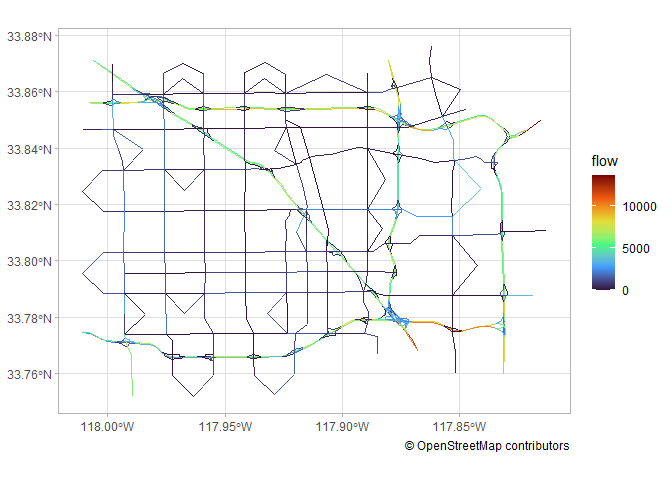
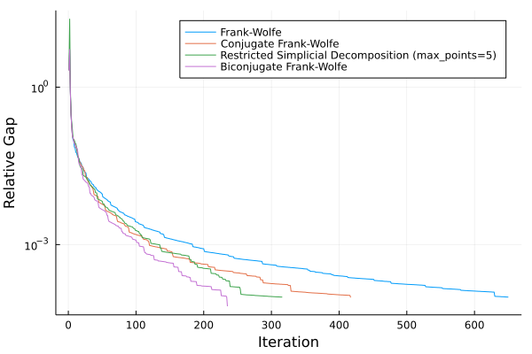

TrafficAssign.jl
================

TrafficAssign is a Julia package for…

1.  Load [Transportation
    Networks](https://github.com/bstabler/TransportationNetworks) data
    or construct traffic data from data frames.
2.  Traffic assignment with User Equilibrium.

## Load traffic data

`load_tntp()` loads [Transportation
Networks](https://github.com/bstabler/TransportationNetworks) data
([TNTP](https://www.bgu.ac.il/~bargera/tntp/) format).

`Traffic()` creates traffic data from trip and network data frames.

``` julia
using TrafficAssign

traffic = load_tntp("Anaheim")
```

    Number of nodes: 416
    Trips:
    1406×3 DataFrame
      Row │ orig   dest   trips
          │ Int64  Int64  Float64
    ──────┼───────────────────────
        1 │     1      2   1365.9
        2 │     1      3    407.4
        3 │     1      4    861.4
        4 │     1      5    354.4
        5 │     1      6    545.1
        6 │     1      7    431.5
        7 │     1      8      1.0
        8 │     1      9     56.8
      ⋮   │   ⋮      ⋮       ⋮
     1400 │    38     31     84.2
     1401 │    38     32     25.1
     1402 │    38     33     24.6
     1403 │    38     34     31.1
     1404 │    38     35     21.4
     1405 │    38     36     19.1
     1406 │    38     37      2.3
                 1391 rows omitted

    Network:
    914×8 DataFrame
     Row │ from   to     free_flow_time  capacity  alpha    beta     toll     leng ⋯
         │ Int64  Int64  Float64         Float64   Float64  Float64  Float64  Floa ⋯
    ─────┼──────────────────────────────────────────────────────────────────────────
       1 │     1    117         1.09046    9000.0     0.15      4.0      0.0   528 ⋯
       2 │     2     87         1.09046    9000.0     0.15      4.0      0.0   528
       3 │     3     74         1.09046    9000.0     0.15      4.0      0.0   528
       4 │     4    233         1.09046    9000.0     0.15      4.0      0.0   528
       5 │     5    165         1.09046    9000.0     0.15      4.0      0.0   528 ⋯
       6 │     6    213         1.09046    9000.0     0.15      4.0      0.0   528
       7 │     7    253         1.09046    9000.0     0.15      4.0      0.0   528
       8 │     8    411         1.0        5400.0     0.15      4.0      0.0   264
      ⋮  │   ⋮      ⋮          ⋮            ⋮         ⋮        ⋮        ⋮        ⋮ ⋱
     908 │   413    404         2.0        5400.0     0.15      4.0      0.0   528 ⋯
     909 │   414     22         1.0        5400.0     0.15      4.0      0.0   264
     910 │   414    405         2.0        5400.0     0.15      4.0      0.0   528
     911 │   415     22         1.0        5400.0     0.15      4.0      0.0   264
     912 │   415    406         2.0        5400.0     0.15      4.0      0.0   528 ⋯
     913 │   416     23         1.0        5400.0     0.15      4.0      0.0   264
     914 │   416    407         2.0        5400.0     0.15      4.0      0.0   528
                                                       1 column and 899 rows omitted

<!-- 

::: {.cell}

:::

::: {.cell}

```{.julia .cell-code}
trips
```

::: {.cell-output .cell-output-stdout}
```
576×3 DataFrame
 Row │ orig   dest   trips
     │ Int64  Int64  Float64
─────┼───────────────────────
   1 │     1      1      0.0
   2 │     1      2    100.0
   3 │     1      3    100.0
   4 │     1      4    500.0
   5 │     1      5    200.0
   6 │     1      6    300.0
   7 │     1      7    500.0
   8 │     1      8    800.0
  ⋮  │   ⋮      ⋮       ⋮
 570 │    24     18      0.0
 571 │    24     19    100.0
 572 │    24     20    400.0
 573 │    24     21    500.0
 574 │    24     22   1100.0
 575 │    24     23    700.0
 576 │    24     24      0.0
             561 rows omitted
```
:::

```{.julia .cell-code}
network
```

::: {.cell-output .cell-output-stdout}
```
76×8 DataFrame
 Row │ from   to     free_flow_time  capacity  alpha    beta     toll     leng ⋯
     │ Int64  Int64  Float64         Float64   Float64  Float64  Float64  Floa ⋯
─────┼──────────────────────────────────────────────────────────────────────────
   1 │     1      2             6.0  25900.2      0.15      4.0      0.0       ⋯
   2 │     1      3             4.0  23403.5      0.15      4.0      0.0
   3 │     2      1             6.0  25900.2      0.15      4.0      0.0
   4 │     2      6             5.0   4958.18     0.15      4.0      0.0
   5 │     3      1             4.0  23403.5      0.15      4.0      0.0       ⋯
   6 │     3      4             4.0  17110.5      0.15      4.0      0.0
   7 │     3     12             4.0  23403.5      0.15      4.0      0.0
   8 │     4      3             4.0  17110.5      0.15      4.0      0.0
  ⋮  │   ⋮      ⋮          ⋮            ⋮         ⋮        ⋮        ⋮        ⋮ ⋱
  70 │    22     23             4.0   5000.0      0.15      4.0      0.0       ⋯
  71 │    23     14             4.0   4924.79     0.15      4.0      0.0
  72 │    23     22             4.0   5000.0      0.15      4.0      0.0
  73 │    23     24             2.0   5078.51     0.15      4.0      0.0
  74 │    24     13             4.0   5091.26     0.15      4.0      0.0       ⋯
  75 │    24     21             3.0   4885.36     0.15      4.0      0.0
  76 │    24     23             2.0   5078.51     0.15      4.0      0.0
                                                    1 column and 61 rows omitted
```
:::

```{.julia .cell-code}

Traffic(trips, network)
```

::: {.cell-output .cell-output-stdout}
```
Number of nodes: 24
Trips:
576×3 DataFrame
 Row │ orig   dest   trips
     │ Int64  Int64  Float64
─────┼───────────────────────
   1 │     1      1      0.0
   2 │     1      2    100.0
   3 │     1      3    100.0
   4 │     1      4    500.0
   5 │     1      5    200.0
   6 │     1      6    300.0
   7 │     1      7    500.0
   8 │     1      8    800.0
  ⋮  │   ⋮      ⋮       ⋮
 570 │    24     18      0.0
 571 │    24     19    100.0
 572 │    24     20    400.0
 573 │    24     21    500.0
 574 │    24     22   1100.0
 575 │    24     23    700.0
 576 │    24     24      0.0
             561 rows omitted

Network:
76×8 DataFrame
 Row │ from   to     free_flow_time  capacity  alpha    beta     toll     leng ⋯
     │ Int64  Int64  Float64         Float64   Float64  Float64  Float64  Floa ⋯
─────┼──────────────────────────────────────────────────────────────────────────
   1 │     1      2             6.0  25900.2      0.15      4.0      0.0       ⋯
   2 │     1      3             4.0  23403.5      0.15      4.0      0.0
   3 │     2      1             6.0  25900.2      0.15      4.0      0.0
   4 │     2      6             5.0   4958.18     0.15      4.0      0.0
   5 │     3      1             4.0  23403.5      0.15      4.0      0.0       ⋯
   6 │     3      4             4.0  17110.5      0.15      4.0      0.0
   7 │     3     12             4.0  23403.5      0.15      4.0      0.0
   8 │     4      3             4.0  17110.5      0.15      4.0      0.0
  ⋮  │   ⋮      ⋮          ⋮            ⋮         ⋮        ⋮        ⋮        ⋮ ⋱
  70 │    22     23             4.0   5000.0      0.15      4.0      0.0       ⋯
  71 │    23     14             4.0   4924.79     0.15      4.0      0.0
  72 │    23     22             4.0   5000.0      0.15      4.0      0.0
  73 │    23     24             2.0   5078.51     0.15      4.0      0.0
  74 │    24     13             4.0   5091.26     0.15      4.0      0.0       ⋯
  75 │    24     21             3.0   4885.36     0.15      4.0      0.0
  76 │    24     23             2.0   5078.51     0.15      4.0      0.0
                                                    1 column and 61 rows omitted
```
:::
:::

-->

## Traffic assignment

`assign_traffic()` solves traffic assignment problems. By default, the
`BiconjugateFrankWolfe()` algorithm is used.

``` julia
res = assign_traffic(traffic)
```

    Start Execution
    Iteration:       1, Objective: 1291920.701, Relative-Gap: 0.025317752, Execution-Time:      0.281
    Iteration:       2, Objective: 1287896.059, Relative-Gap: 0.002939095, Execution-Time:      0.813
    Iteration:       3, Objective: 1287174.480, Relative-Gap: 0.002377171, Execution-Time:      0.899
    Iteration:       4, Objective: 1286261.622, Relative-Gap: 0.001157943, Execution-Time:      0.946
    Iteration:       5, Objective: 1286219.627, Relative-Gap: 0.000541186, Execution-Time:      1.221
    Iteration:       6, Objective: 1286196.674, Relative-Gap: 0.000523331, Execution-Time:      1.252
    Iteration:       7, Objective: 1286137.001, Relative-Gap: 0.000476912, Execution-Time:      1.315
    Iteration:       8, Objective: 1286082.018, Relative-Gap: 0.000161641, Execution-Time:      1.365
    Iteration:       9, Objective: 1286073.753, Relative-Gap: 0.000144621, Execution-Time:      1.417
    Iteration:      10, Objective: 1286053.650, Relative-Gap: 0.000091432, Execution-Time:      1.449

    TrafficAssign.TrafficAssignResults(TrafficImpl(416, [1, 2, 3, 4, 5, 6, 7, 8, 9, 9  …  412, 412, 413, 413, 414, 414, 415, 415, 416, 416], [117, 87, 74, 233, 165, 213, 253, 411, 379, 395  …  21, 402, 21, 404, 22, 405, 22, 406, 23, 407], sparse([2, 3, 4, 5, 6, 7, 8, 9, 10, 11  …  28, 29, 30, 31, 32, 33, 34, 35, 36, 37], [1, 1, 1, 1, 1, 1, 1, 1, 1, 1  …  38, 38, 38, 38, 38, 38, 38, 38, 38, 38], [1171.2, 721.1, 1222.5, 243.4, 637.4, 682.3, 44.3, 198.6, 12.3, 35.8  …  42.1, 16.6, 128.1, 87.1, 54.0, 47.9, 234.6, 63.8, 41.3, 6.0], 416, 416), Graphs.SimpleGraphs.SimpleDiGraph{Int64}(914, [[117], [87], [74], [233], [165], [213], [253], [411], [379, 395], [338, 362]  …  [38, 53, 390, 408, 416], [211, 407, 409], [167, 408, 410], [396, 409, 411], [8, 410], [21, 402], [21, 404], [22, 405], [22, 406], [23, 407]], [[88], [62], [75], [234], [118], [166], [214], [411], [379, 395], [338, 362]  …  [38, 53, 390, 408, 416], [212, 407, 409], [168, 408, 410], [396, 409, 411], [8, 410], [21, 402], [21, 404], [22, 405], [22, 406], [23, 407]]), BPRImpl([1.090458488, 1.090458488, 1.090458488, 1.090458488, 1.090458488, 1.090458488, 1.090458488, 1.0, 1.0, 1.0  …  1.0, 2.0, 1.0, 2.0, 1.0, 2.0, 1.0, 2.0, 1.0, 2.0], [1.090458488, 1.090458488, 1.090458488, 1.090458488, 1.090458488, 1.090458488, 1.090458488, 1.0, 1.0, 1.0  …  Inf, 2.0, Inf, 2.0, Inf, 2.0, Inf, 2.0, Inf, 2.0], [9000.0, 9000.0, 9000.0, 9000.0, 9000.0, 9000.0, 9000.0, 5400.0, 5400.0, 5400.0  …  5400.0, 5400.0, 5400.0, 5400.0, 5400.0, 5400.0, 5400.0, 5400.0, 5400.0, 5400.0], [0.15, 0.15, 0.15, 0.15, 0.15, 0.15, 0.15, 0.15, 0.15, 0.15  …  0.15, 0.15, 0.15, 0.15, 0.15, 0.15, 0.15, 0.15, 0.15, 0.15], [4.0, 4.0, 4.0, 4.0, 4.0, 4.0, 4.0, 4.0, 4.0, 4.0  …  4.0, 4.0, 4.0, 4.0, 4.0, 4.0, 4.0, 4.0, 4.0, 4.0], [0.0, 0.0, 0.0, 0.0, 0.0, 0.0, 0.0, 0.0, 0.0, 0.0  …  0.0, 0.0, 0.0, 0.0, 0.0, 0.0, 0.0, 0.0, 0.0, 0.0], [0.0, 0.0, 0.0, 0.0, 0.0, 0.0, 0.0, 0.0, 0.0, 0.0  …  0.0, 0.0, 0.0, 0.0, 0.0, 0.0, 0.0, 0.0, 0.0, 0.0], [0.0, 0.0, 0.0, 0.0, 0.0, 0.0, 0.0, 0.0, 0.0, 0.0  …  0.0, 0.0, 0.0, 0.0, 0.0, 0.0, 0.0, 0.0, 0.0, 0.0], [5280.0, 5280.0, 5280.0, 5280.0, 5280.0, 5280.0, 5280.0, 2640.0, 2640.0, 2640.0  …  2640.0, 5280.0, 2640.0, 5280.0, 2640.0, 5280.0, 2640.0, 5280.0, 2640.0, 5280.0])), [7074.9, 9662.5, 7669.000000000003, 12173.800000000003, 2586.7999999999984, 6576.600000000001, 7137.0999999999985, 722.0999999999997, 1317.8580762568981, 919.641923743101  …  564.0461041884911, 1396.4999999999998, 1495.8538958115087, 1245.3000000000002, 509.3999999999999, 619.8, 934.2, 904.5999999999998, 387.90000000000015, 1522.5], TrafficAssignLogs(1.2859360746767877e6, 1.2860536502344077e6, [1.2919207006261928e6, 1.2878960591928903e6, 1.2871744801439045e6, 1.2862616220919997e6, 1.2862196265185215e6, 1.286196673702687e6, 1.2861370010556476e6, 1.2860820184638724e6, 1.286073753071975e6, 1.2860536502344077e6], [0.025317752227496097, 0.002939095375328338, 0.002377171271697498, 0.0011579431276952786, 0.0005411859152905796, 0.0005233310815579923, 0.00047691214982615546, 0.00016164148263084357, 0.00014462108363500186, 9.14318836957612e-5], 1.659854130228e9, [0.28100013732910156, 0.812999963760376, 0.8990001678466797, 0.9460000991821289, 1.2209999561309814, 1.252000093460083, 1.315000057220459, 1.3650000095367432, 1.4170000553131104, 1.4490001201629639]))

``` julia
# Get flow from traffic assignment results
res.flow
```



## Traffic assignment algorithms

Now, the following algorithms are available.

-   `FrankWolfe()`
-   `ConjugateFrankWolfe()`
-   `BiconjugateFrankWolfe()`
-   `RestrictedSimplicialDecomposition()`

``` julia
# Requires long execution time.
traffic = load_tntp("GoldCoast")

res_FW = assign_traffic(traffic, algorithm=FrankWolfe())
res_CFW = assign_traffic(traffic, algorithm=ConjugateFrankWolfe())
res_BFW = assign_traffic(traffic, algorithm=BiconjugateFrankWolfe())
res_RSD_5 = assign_traffic(traffic, algorithm=RestrictedSimplicialDecomposition(max_points=5))
# res_RSD_10 = assign_traffic(traffic, algorithm=RestrictedSimplicialDecomposition(max_points=10))
```



## References

-   [Maria Mitradjieva, Per Olov Lindberg, (2012) The Stiff Is
    Moving—Conjugate Direction Frank-Wolfe Methods with Applications to
    Traffic Assignment\*. Transportation Science
    47(2):280-293.](https://doi.org/10.1287/trsc.1120.0409)
-   [Hearn, D.W., Lawphongpanich, S., Ventura, J. (1987). Restricted
    simplicial decomposition: Computation and extensions. In: Hoffman,
    K.L., Jackson, R.H.F., Telgen, J. (eds) Computation Mathematical
    Programming. Mathematical Programming Studies, vol 31. Springer,
    Berlin, Heidelberg.](https://doi.org/10.1007/BFb0121181)
