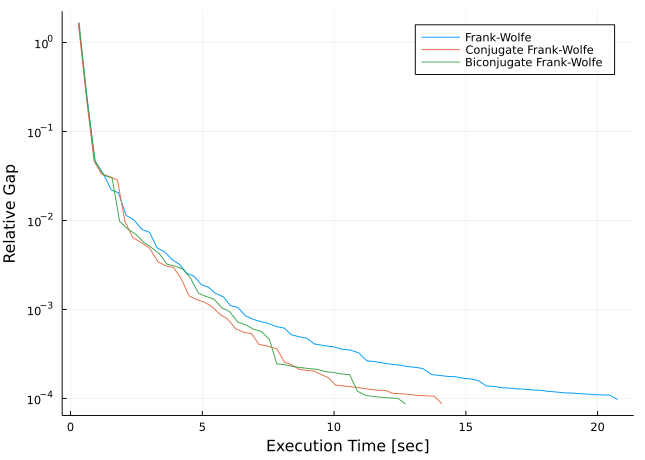

TrafficAssig.jl
================

TrafficAssig is a Julia package for…

1.  Load [Transportation
    Networks](https://github.com/bstabler/TransportationNetworks) data
    or construct traffic data from data frames.
2.  Traffic assignment with User Equilibrium.

## Examples

``` julia
using TrafficAssig

tntp = load_tntp("Anaheim")
assign_traffic(tntp)
```

    Start Execution

    Iteration:       1, Objective: 1291920.700626, Relative-Gap:      0.025318, Execution-Time:      0.066000
    Iteration:       2, Objective: 1287896.059193, Relative-Gap:      0.002939, Execution-Time:      0.117000
    Iteration:       3, Objective: 1287174.480144, Relative-Gap:      0.002377, Execution-Time:      0.149000

    Iteration:       4, Objective: 1286261.622092, Relative-Gap:      0.001158, Execution-Time:      0.193000
    Iteration:       5, Objective: 1286219.626421, Relative-Gap:      0.000541, Execution-Time:      0.217000
    Iteration:       6, Objective: 1286196.673562, Relative-Gap:      0.000523, Execution-Time:      0.267000

    Iteration:       7, Objective: 1286137.001106, Relative-Gap:      0.000477, Execution-Time:      0.311000
    Iteration:       8, Objective: 1286082.018464, Relative-Gap:      0.000162, Execution-Time:      0.345000
    Iteration:       9, Objective: 1286073.753091, Relative-Gap:      0.000145, Execution-Time:      0.389000

    Iteration:      10, Objective: 1286053.650219, Relative-Gap:      0.000091, Execution-Time:      0.417000

    TrafficAssig.TrafficAssigResults(TrafficImpl(416, [1, 2, 3, 4, 5, 6, 7, 8, 9, 9  …  412, 412, 413, 413, 414, 414, 415, 415, 416, 416], [117, 87, 74, 233, 165, 213, 253, 411, 379, 395  …  21, 402, 21, 404, 22, 405, 22, 406, 23, 407], sparse([2, 3, 4, 5, 6, 7, 8, 9, 10, 11  …  28, 29, 30, 31, 32, 33, 34, 35, 36, 37], [1, 1, 1, 1, 1, 1, 1, 1, 1, 1  …  38, 38, 38, 38, 38, 38, 38, 38, 38, 38], [1171.2, 721.1, 1222.5, 243.4, 637.4, 682.3, 44.3, 198.6, 12.3, 35.8  …  42.1, 16.6, 128.1, 87.1, 54.0, 47.9, 234.6, 63.8, 41.3, 6.0], 416, 416), Graphs.SimpleGraphs.SimpleDiGraph{Int64}(914, [[117], [87], [74], [233], [165], [213], [253], [411], [379, 395], [338, 362]  …  [38, 53, 390, 408, 416], [211, 407, 409], [167, 408, 410], [396, 409, 411], [8, 410], [21, 402], [21, 404], [22, 405], [22, 406], [23, 407]], [[88], [62], [75], [234], [118], [166], [214], [411], [379, 395], [338, 362]  …  [38, 53, 390, 408, 416], [212, 407, 409], [168, 408, 410], [396, 409, 411], [8, 410], [21, 402], [21, 404], [22, 405], [22, 406], [23, 407]]), BPR([1.090458488, 1.090458488, 1.090458488, 1.090458488, 1.090458488, 1.090458488, 1.090458488, 1.0, 1.0, 1.0  …  1.0, 2.0, 1.0, 2.0, 1.0, 2.0, 1.0, 2.0, 1.0, 2.0], [1.090458488, 1.090458488, 1.090458488, 1.090458488, 1.090458488, 1.090458488, 1.090458488, 1.0, 1.0, 1.0  …  Inf, 2.0, Inf, 2.0, Inf, 2.0, Inf, 2.0, Inf, 2.0], [9000.0, 9000.0, 9000.0, 9000.0, 9000.0, 9000.0, 9000.0, 5400.0, 5400.0, 5400.0  …  5400.0, 5400.0, 5400.0, 5400.0, 5400.0, 5400.0, 5400.0, 5400.0, 5400.0, 5400.0], [0.15, 0.15, 0.15, 0.15, 0.15, 0.15, 0.15, 0.15, 0.15, 0.15  …  0.15, 0.15, 0.15, 0.15, 0.15, 0.15, 0.15, 0.15, 0.15, 0.15], [4.0, 4.0, 4.0, 4.0, 4.0, 4.0, 4.0, 4.0, 4.0, 4.0  …  4.0, 4.0, 4.0, 4.0, 4.0, 4.0, 4.0, 4.0, 4.0, 4.0], [0.0, 0.0, 0.0, 0.0, 0.0, 0.0, 0.0, 0.0, 0.0, 0.0  …  0.0, 0.0, 0.0, 0.0, 0.0, 0.0, 0.0, 0.0, 0.0, 0.0], [0.0, 0.0, 0.0, 0.0, 0.0, 0.0, 0.0, 0.0, 0.0, 0.0  …  0.0, 0.0, 0.0, 0.0, 0.0, 0.0, 0.0, 0.0, 0.0, 0.0], [0.0, 0.0, 0.0, 0.0, 0.0, 0.0, 0.0, 0.0, 0.0, 0.0  …  0.0, 0.0, 0.0, 0.0, 0.0, 0.0, 0.0, 0.0, 0.0, 0.0], [5280.0, 5280.0, 5280.0, 5280.0, 5280.0, 5280.0, 5280.0, 2640.0, 2640.0, 2640.0  …  2640.0, 5280.0, 2640.0, 5280.0, 2640.0, 5280.0, 2640.0, 5280.0, 2640.0, 5280.0])), [7074.9000000000015, 9662.5, 7669.000000000003, 12173.800000000005, 2586.7999999999984, 6576.600000000002, 7137.099999999999, 722.0999999999999, 1317.8581802935394, 919.6418197064601  …  564.0461563804106, 1396.5000000000005, 1495.8538436195895, 1245.3000000000004, 509.4, 619.8000000000002, 934.2, 904.6, 387.90000000000026, 1522.5000000000005], TrafficAssig.TrafficAssigLogs(1.2859360747738602e6, 1.2860536502190554e6, [1.291920700626193e6, 1.2878960591928903e6, 1.2871744801439047e6, 1.2862616220920002e6, 1.2862196264213196e6, 1.2861966735620052e6, 1.286137001106453e6, 1.2860820184640046e6, 1.286073753090791e6, 1.2860536502190554e6], [0.025317752227496094, 0.0029390953172753753, 0.002377171213677242, 0.0011579431276954597, 0.0005411847802946837, 0.0005233299127582479, 0.0004769111300320562, 0.00016164163885600162, 0.00014462122430136348, 9.14317962624003e-5], 1.65928291923e9, [0.06599998474121094, 0.11699986457824707, 0.14899992942810059, 0.19300007820129395, 0.21700000762939453, 0.2669999599456787, 0.31099987030029297, 0.3450000286102295, 0.38899993896484375, 0.41700005531311035]))

``` julia
tntp = load_tntp("Barcelona")

res_FW = assign_traffic(tntp, algorithm=FrankWolfe())
res_CFW = assign_traffic(tntp, algorithm=ConjugateFrankWolfe())
res_BFW = assign_traffic(tntp, algorithm=BiconjugateFrankWolfe())
```



## Comparisons
